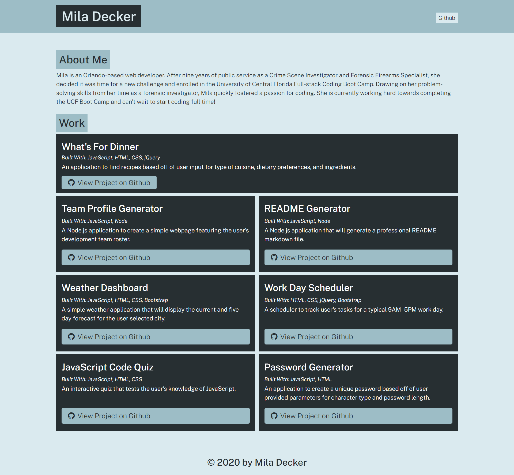

# Portfolio Generator
[](https://github.com/deckiedevs/portfolio-generator/issues) [](https://github.com/deckiedevs/portfolio-generator/graphs/contributors) 

## Description
A Node.js application to create a professional portfolio page.

## Contents
* [Installation](#Installation)
* [Usage](#Usage)
   * [Screenshots](#Screenshots)
* [Questions](#Questions)
* [Credits](#Credits)


## Installation
To use this application, please install: 
```
npm i inquirer
```
    
## Usage
After installing the required npm packages, use the command line to navigate to the root of the application and run `node app`.  Follow prompts to enter project information.  The generated portfolio page will be created in the `./dist` folder. 
    
### Screenshots



## Questions
If you have any questions about the repo, please [open an issue](https://github.com/deckiedevs/portfolio-generator/issues) or contact me via email at deckiedevs@gmail.com. You can find more of my work on my GitHub, [deckiedevs](https://github.com/deckiedevs/).